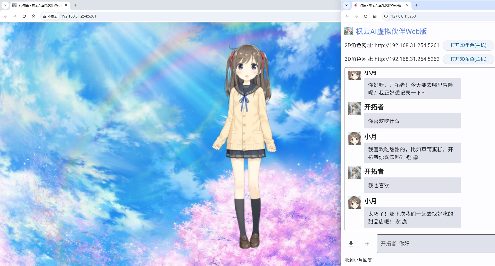
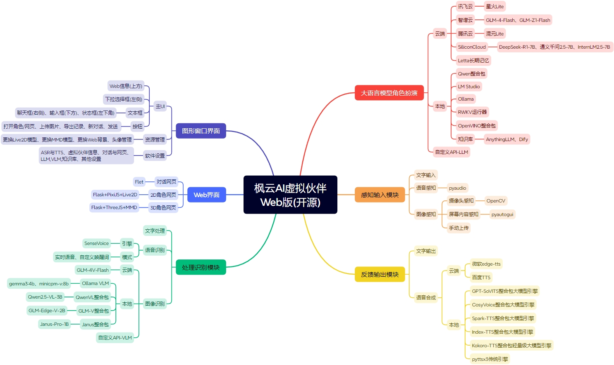

# 枫云AI虚拟伙伴Web版

  

**枫云AI虚拟伙伴Web版** 是一个高自由度的网页二次元AI数字人框架，现已升级至3.0版本。支持实时语音识别、文本对话、语音合成、图像识别、长期记忆、Live2D/MMD 3D角色展示等功能。用户可以通过Web界面与虚拟伙伴进行互动，虚拟伙伴能够根据用户的输入进行智能回复，并支持多种语言模型和语音合成引擎。


## 功能特性

- **高自由度与模块化扩展性**：面向开发者的开源框架，支持修改代码二次开发以实现高度个性化的AI伙伴。
- **广泛的开源AI生态**：对接多种云端/本地大语言模型、多模态模型、语音合成大模型。支持DeepSeek-R1推理模型、Janus-Pro多模态模型等，并兼容OpenAI标准API。
- **实时拟真语音交互**：通过SenseVoice本地ASR引擎实现实时语音识别，支持流畅的语音交流。语音合成功能支持打断，用户可通过语音、按钮或按键方式中断过长的回复。
- **多模态图像识别**：支持电脑屏幕画面/摄像头内容/手动上传图片的多模态图像识别。
- **本地知识库**：对接本地AnythingLLM、Dify聊天助手提升虚拟伙伴的理解与回应精度。
- **多设备全平台访问**：在Windows电脑上运行后，局域网内的设备(如电脑、手机、平板、车机)可通过浏览器展示虚拟伙伴。
- **长期记忆功能**：可选Letta长期记忆框架，通过分层内存管理机制，在不同会话和任务间保持状态，解决传统LLM无状态问题。
- **丰富的自定义设置**：用户可自定义虚拟伙伴的名称、语音、人设、Live2D/MMD 3D角色模型等，并个性化配置ASR、TTS、LLM、VLM等模块。



## 安装与使用

### 环境要求

- **操作系统**：Windows 10或更高版本
- **处理器**：Intel Core i5 8th / AMD R5 3000 系列
- **内存**：8GB RAM
- **显卡**：Intel UHD 620 核显 / AMD Vega 7 核显
- **存储空间**：至少2GB可用空间
- **网络**：支持联网使用，也支持下载本地AI引擎DLC离线使用
- **麦克风**：0.5米拾音（语音输入需求）
- **摄像头**：720P彩色（多模态图像识别需求）

### 安装步骤

#### 方法一：通过源码安装(面向开发者)

1. **克隆仓库**

   首先，确保您已经安装了Git。然后，打开命令行工具并运行以下命令来克隆仓库：

   ```bash
   git clone https://github.com/swordswind/ai_virtual_mate_web.git 
   cd ai_virtual_mate_web
   ```

2. **安装依赖**

   在项目根目录下，分别运行以下命令安装所需的Python依赖。请忽略红字冲突提示，不影响正常使用：

   ```bash
   pip install -r requirements.txt
   pip install flet==0.13.0
   pip install letta==0.6.7
   ```

3. **配置环境**

   - 如果需要使用云端免费API，请在 `data/set/key_set.txt` 中填写相应的API密钥。
   - 从 [https://modelscope.cn/models/iic/SenseVoiceSmall-onnx](https://modelscope.cn/models/iic/SenseVoiceSmall-onnx) 下载语音识别模型，解压放入 `data/model` 文件夹。
   
4. **运行应用**

   在项目根目录下，运行以下命令启动应用：

   ```bash
   python main.py
   ```

   应用启动后，可以通过浏览器访问 `http://127.0.0.1:5261` 进入Web界面。

#### 方法二：下载安装整合包(简单易上手)

1. **下载整合包**

   从官方网站下载整合包：[下载链接](https://swordswind.github.io/2024/07/09/mateweb/)

2. **解压并运行**

   解压下载的压缩包，双击运行"枫云AI虚拟伙伴Web版.bat"文件即可启动软件。

3. **本地AI引擎（可选）**

   如果您希望实现软件的本地运行，可以下载AI虚拟伙伴插件-本地端侧AI引擎DLC：[下载链接](https://swordswind.github.io/2024/03/13/engine/)

### 使用说明

- **启动软件**：双击运行程序，软件主界面将自动弹出AI虚拟伙伴对话网页。首次使用建议修改默认密码。
- **桌面端操作**：软件默认关闭实时语音交互，按下"Alt+x"可切换实时语音开关。用户也可以在输入框内输入文本与虚拟伙伴进行对话。
- **网页端操作**：通过浏览器访问对话网页，输入用户名和密码登录后即可与虚拟伙伴进行交流。支持导出聊天记录和开启新对话。Web端在非本电脑的其他设备上默认情况下仅支持打字聊天和显示角色，不支持语音识别、语音输出和摄像头识别。如需串流其他设备，推荐使用AudioReplay和iVCam软件。
- **Live2D角色互动**：点击主界面或对话网页上的“2D角色”按钮，将打开Live2D角色展示网页。用户可在网页上通过滑动鼠标或手指实时与虚拟伙伴互动，虚拟伙伴视线持续跟随鼠标或手指，并且支持口型匹配语音输出。
- **MMD 3D角色展示**：点击主界面或对话网页上的“3D角色”按钮，将打开MMD 3D角色展示网页，虚拟伙伴嘴部会跟随语音输出动起来。鼠标操作：按住左键调视角；滚动中键调大小；按住右键调位置。触屏操作：单手指调视角；双手指调大小和位置。
- **MMD 3D动作展示**：点击主界面的“3D动作”按钮，将打开MMD 3D动作展示网页。用户可前往资源管理便捷更换MMD 3D的vmd动作，以及前往软件设置的更多设置选择、开启或关闭动作mp3背景音乐。

## 项目结构

```
ai_virtual_mate_web/
├── data/                    # 数据文件
│   ├── cache/               # 缓存文件
│   ├── db/                  # 配置文件
│   ├── history/             # 对话网页保存聊天记录
│   ├── image/               # 图片资源
│   ├── model/               # 语音识别模型资源
│   ├── music/               # MMD 3D动作音乐目录
│   └── set/                 # 设置文件
├── dist/                    # 静态资源
│   └── assets/              # Live2D/MMD 3D模型和Web资源
├── funasr_onnx/             # 语音识别库
├── gui.py                   # GUI相关代码
├── gui_sub.py               # GUI子模块
├── system_init.py           # 系统初始化
├── asr.py                   # 语音识别模块
├── chat_web.py              # Web聊天界面
├── function.py              # 功能函数
├── llm.py                   # 语言模型模块
├── live2d.py                # Live2D模块
├── mmd.py                   # MMD 3D模块
├── main.py                  # 主程序
├── tts.py                   # 语音合成模块
├── vlm.py                   # 图像识别模块
└── requirements.txt         # 依赖文件
```

## 配置说明

### 配置文件

- **data/db/config.json**：主配置文件，包含虚拟伙伴名称、语音识别灵敏度、语音合成引擎等配置项。
- **data/set/key_set.txt**：API密钥配置文件，包含SiliconCloud、BigModel、Spark等平台的API密钥。
- **data/set/more_set.json**：更多配置文件，包含主配置文件以外的设置。

## 常见问题解答

1. **点击打开角色但不显示怎么办？**
   - 软件不自带MMD 3D模型，进入资源管理里面添加。如果是默认的Live2D角色不显示，则是Windows系统渲染库的问题，可能是因为Windows更新出错导致，如果有条件可在另一台电脑上使用本软件。如果是更换后的Live2D/MMD 3D不显示，可能是模型兼容性问题或模型路径配置错误，可尝试其它Live2D/MMD 3D模型或恢复默认设置。

2. **服务不可用怎么办？**
   - 检查API Key是否配置正确以及网络连接是否稳定。若网络无问题，尝试更换对话语言模型或语音合成引擎，或下载DLC启用本地AI引擎。

3. **语音识别不完整怎么办？**
   - 前往软件设置调低语音识别灵敏度，保存设置后重启软件。

4. **伙伴语音自我打断怎么办？**
   - 推荐选择自定义唤醒词，避免自我打断；也可以戴耳机使用，或调低扬声器音量。

5. **对话聊天网页显示异常怎么办？**
   - 该问题通常由加速器或代理软件冲突引起，请关闭相关软件。

6. **MMD 3D角色/动作网页卡顿怎么办？**
   - 谷歌浏览器右上角三个点→设置→左侧栏“系统”，打开使用图形加速功能（如果可用），之后MMD模型会在GPU上加载，动作更加流畅。

7. **被杀毒软件清理了怎么办？**
   - 该情况属于误报毒行为，请从隔离区恢复软件并加入白名单（信任区）。

## 开源协议

本项目采用 **GPL-3.0** 开源协议，详情请参阅 [LICENSE](LICENSE) 文件。

## 贡献指南

欢迎贡献代码！请遵循以下步骤：

1. Fork 本项目
2. 创建您的特性分支
3. 提交您的更改
4. 推送到分支
5. 提交 Pull Request

## 致谢

- 感谢所有贡献者和用户的支持！
- 感谢以下开源项目的支持：
  - GPT-SoVITS: [https://github.com/RVC-Boss/GPT-SoVITS](https://github.com/RVC-Boss/GPT-SoVITS)
  - opencv: [https://github.com/opencv/opencv-python](https://github.com/opencv/opencv-python)
  - FunAudioLLM: [https://github.com/FunAudioLLM](https://github.com/FunAudioLLM)
  - Letta: [https://github.com/letta-ai/letta](https://github.com/letta-ai/letta)
  - edge-tts: [https://github.com/rany2/edge-tts](https://github.com/rany2/edge-tts)
  - Qwen2.5-VL: [https://github.com/QwenLM/Qwen2.5-VL](https://github.com/QwenLM/Qwen2.5-VL)
  - ollama: [https://github.com/ollama/ollama](https://github.com/ollama/ollama)
  - flet: [https://github.com/flet-dev/flet](https://github.com/flet-dev/flet)
  - flask: [https://github.com/pallets/flask](https://github.com/pallets/flask)
  - live2d: [https://github.com/nladuo/live2d-chatbot-demo](https://github.com/nladuo/live2d-chatbot-demo)
  - three.js: [https://github.com/mrdoob/three.js](https://github.com/mrdoob/three.js)

## 联系开发者团队

如有任何问题或建议，请联系开发者团队：

- **Email**: swordswind@qq.com
- **GitHub**: [swordswind](https://github.com/swordswind)